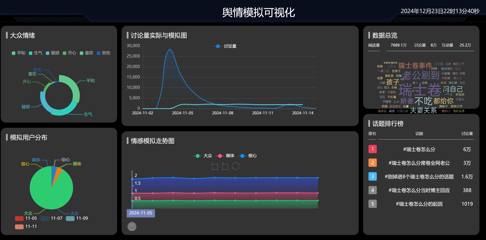
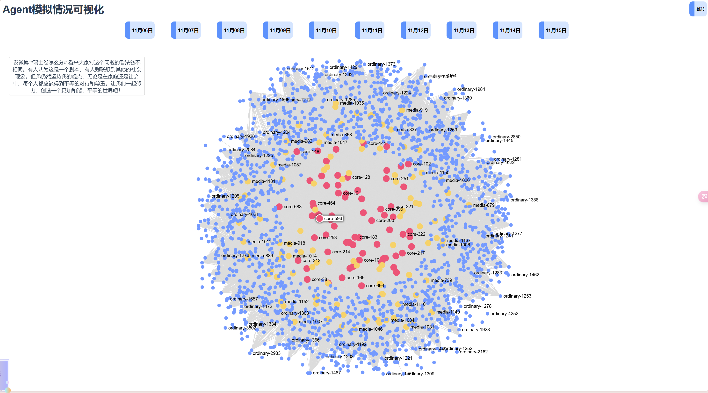

# 基于LLM和ABM的网络舆情事件模拟-以微博#瑞士卷怎么分#为例
这是一个数据挖掘和数据可视化课堂的期末大作业，选题为“基于LLM和ABM的网络舆情事件模拟-以微博#瑞士卷怎么分#为例”，我们首先爬取数据。然后基于LLM和ABM进行该事件的模拟，并使用css，html，vue搭建前后端进行可视化，直观评估模拟效果。

## 微博数据爬虫
参考github上的 Love Spider框架 github url:https://github.com/2904202165/LoveSpider，
爬取微博上话题标签为#瑞士卷怎么分#的微博帖子数据，博主话题贡献度榜单，高贡献度的博主主页和最近微博，一共7148条帖子，14位高贡献度用户的主页和最近帖子。

```bash
git clone https://github.com/2904202165/LoveSpider.git
```

```bash
Scrapy：pip install scrapy
```

```bash
pip install -r requirements.txt
```

```bash
scrapy crawl search -s JOBDIR=crawls/search
```

## 社交媒体事件模拟
我们以HiSim（Unveiling the Truth and Facilitating Change: Towards Agent-based ）的方法为基础，并做了一些修改，我们将用户划分为核心用户、媒体用户和普通用户，核心用户用LLM模拟，普通用户用ABM模拟，媒体用户在其中起到扩散作用。宏观上，用百川大模型模拟10轮后和微博全站数据分析进行对比，微观上，我们对比单个Agent单轮模拟和现实发布内容的相似度。
我们模拟的框架基于Casevo: Cognitive agents and social evolution simulator

### 数据处理
#### 用户划分
首先，我们把出现在前30的微博用户都划分到核心用户中，  然后依据"user_authentication"进行用户划分
金V也称为红V，是各领域近30天阅读数≥1000万、铁粉数≥1000（也有的资料说是1万）的高影响力创作者。
橙V也称为黄V，是各领域近30天阅读数≥100万、铁粉数≥100的大V的认证标识，是微博的优质创作者；

  1.核心用户(红V,金V)
  2.媒体用户(除去商家的蓝V)
  3.普通用户(橙V,黄V,普通用户)
在实际过程中我们发现，蓝V是企业认证用户，和一般的媒体用户还存在一定差距，一些商家借#瑞士卷怎么分进行事件营销推销自家的产品，作用不可忽视，因此在这次事件中我们用gpt3.5_turbo找出蓝V中为商家的用户也划分到核心用户中。

#### 核心用户“人设”和“立场”处理
经过chatgpt4o调试和小组内讨论，我们根据微博内容将主要的“人设”和“立场”分为以下几类：
1. 自我牺牲型母亲: "常常把自己放在家庭中的最后，认为自己不重要，乐意为家人牺牲。她可能会想，“孩子们最需要，我得为他们着想。”"
2.   传统性别分工型丈夫: "表现出一种传统性别角色分配的态度，认为自己应优先享受资源，妻子和孩子次之。"
3.   情感需求型妻子: "通过“瑞士卷怎么分”来测试丈夫的关心与爱，期待丈夫能在细节上关注自己。"
4.   反感性别对立观点: "批判这种讨论，认为现代人应该理性看待家庭关系，而非将所有争议聚焦在琐事上。"
5.   现代家庭独立型女性: "自信、独立，认为婚姻中的平等与自我照顾同样重要，推崇个人的自由选择。"
6.   幽默反转型男性: "风趣、调侃，以轻松幽默的方式处理日常生活中的小冲突。"
7.   消费降级批判型: "认为这种讨论是无意义的消费文化的体现，对这种过度关心“吃”以及“分配”方式感到厌倦。"
8.   借势营销商家: "利用事件热度，紧跟热点话题，增加曝光度，通过与用户情感共鸣的内容传递产品信息，提升品牌亲和力。"
我们使用gpt3.5_turbo将每一个核心用户发微博的内容作为输入判断发帖人人设和立场，并将它作为核心用户的初始属性。

#### 高影响力核心用户“立场”增强
我们将爬取到的第3部分也就是有影响力的用户的主页和最近发过的5条微博，使用gpt3.5_turbo，进行该用户的简介，并将该部分简介加入到“立场”中增强高影响力核心用户的独特性。

#### 每种类型用户“初始态度分数”和“初始微博”处理
对于核心用户和普通用户：我们将2024/11/5 23:59作为模拟的开始节点，核心用户之前发的微博内容作为“初始微博”，普通用户没有“初始微博”。核心用户和普通用户都将之前发的微博内容用SnowNLP处理得到“初始态度分数”。
对于媒体用户：媒体在本次事件中大多数保持中立，因此我们将“初始态度分数”设为0.5。

#### 核心用户和媒体用户“影响力分数”处理
对于核心用户和媒体用户，我们将它们最开始发的微博的点赞数、评论数和转发数加起来，创建鲁棒缩放器并进行拟合，得到“影响力分数”

得到三个json格式的数据：core.json，media.json，ordinary.json

### 建模分析
#### 核心用户（LLM-based）
我们使用Baichuan3-Turbo API模拟核心用户，核心用户可以接受文字输入，同时也可以输出文字

###### 核心用户属性
- 1. 用户描述（description）
举例：f'用户id为{cur_person['user_id']},来自 {cur_person["ip"]},昵称为{cur_person['nickname']},人设是{cur_person['character']},在这件事的立场是{cur_person['view']}'
- 2. 上下文（context）：

上一轮你发过微博：{{context}}   

这是你第一次发微博，当前没有明确立场。  

- 3. 整个事件的背景信息（background）

##### 核心用户行动过程
我们使用CoT(思维链)的方式模拟核心用户看到热门微博，结合自己上一轮的记忆和时间背景行动。
1. 总结自己上一轮的观点和立场：大V首先根据自己上一轮的行为，背景信息和自身属性，总结上一轮微博自己的立场和观点。
2. 结合“看到”的热门微博，做出决策并采取行动。
决策类型：发微博/转发/点赞/什么都不做

#### 普通用户模拟（Agent_based modeling）
我们参考传播动力学中的BC模型（Bailey-Chen Model）对普通用户进行模拟，并在此基础上进行了一定的调整。
普通用户只能接受核心用户的态度（float类型输入），输出自己的态度（float类型输出）
我们认为普通用户更容易受到和自己观点相近的观点的影响，会忽视那些和自己观点相左的意见。
##### 普通用户属性：
ID ，nickname和态度分数
##### 普通用户行动过程
1. 将该轮激活的核心用户作为自己的邻居，选择其中的一部分
2. 对于每一个邻居代理，计算该邻居代理和该用户态度的差异，设置一个态度被影响的阈值
3. 如果差异在阈值内，则更新自己的态度

#### 媒体用户模拟
在#瑞士卷怎么分这个事件中，媒体用户的态度保持中立且不会，媒体用户在该事件的模拟中起的扩散作用，
更多的核心用户加入讨论后，加入讨论的媒体用户也会增多，而媒体用户加入讨论后，使得更多的普通用户看到这件事，促进了整个事件的扩散。
因此，媒体用户模拟返回的是该轮激活的媒体用户总数

#### 环境模拟
##### 激活Agent
根据代理类型获取激活概率。
- 核心用户：核心用户的激活概率不变，高影响力核心用户的激活概率会降低
        P(core) = P(core_base)
            如果agent.influence_score > 100 P -= 0.01 if > 300 P -= 0.02
- 媒体用户：媒体用户激活概率依赖核心用户激活人数，高影响力媒体用户的激活概率也会降低
        P(media) = P(media_base) + α * N(core)（α是超参数）
            如果agent.influence_score > 200 P -= 0.02 if > 400 P -= 0.04
- 普通用户：普通用户激活概率依赖媒体用户激活人数，媒体用户和核心用户的互动
        P(user) = P(user_base) + β * N(media) + γ * N(core) * N(media)（β，γ是超参数）

##### 时间步
开始模拟的时间设为：11-05 23:59
每一轮时间步迭代，模拟每一天过去

##### 推荐系统
结合推荐系统的popular和recency原则，该轮模拟中，我们将上一轮所有帖子的点赞数+转发数中最多的3个微博帖子作为该核心用户“看到”的微博

##### Agent之间互动
核心用户接收到推荐系统传递的热门微博，结合自己上一轮的反应和自己的属性，选择发微博/点赞看到的微博/转发/什么也不干，同时输出新的态度分数
普通用户接收到核心用户的态度分数，据此改变自己的态度分数，普通用户不能对核心用户产生影响。
核心用户被激活的人数越多，媒体用户被激活的概率会增加，普通用户被激活的概率也会相应增加，直到达到阈值。

##### 保存日志
每一轮模拟结束时，我们将该轮次
激活的核心用户ID，核心用户的态度分数，核心用户被激活的人数，每一个激活的核心用户的反应
媒体用户ID，媒体用户被激活的人数，
普通用户ID，普通用户的态度分数，普通用户被激活的人数。
写入日志

## 结果评估和可视化（网页搭建）
我们使用微观和宏观两种方式评估该事件社交媒体模拟的有效性。
宏观
绘制每个轮次被激活的Agent总数的变化曲线，和微博官方给的参与度曲线变化进行对比
绘制核心用户微博内容词云图，和微博官方的词云图对比
绘制每个轮次被激活的Agent的平均态度分数变化曲线，和微博官方的态度柱状图进行粗略对比
微观
我们将每一轮每个Agent的反应的进行可视化

部分网页展示：
可视化大屏


社交媒体网络


### 参考文献：
Unveiling the Truth and Facilitating Change: Towards Agent-based Large-scale Social Movement Simulation
On the limits of agency in agent-based models

